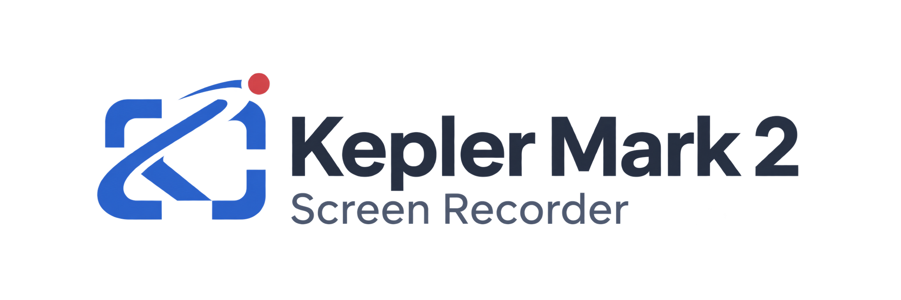
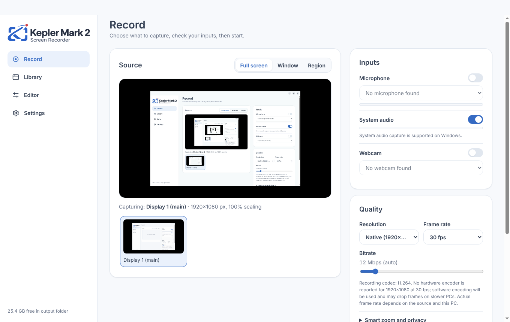
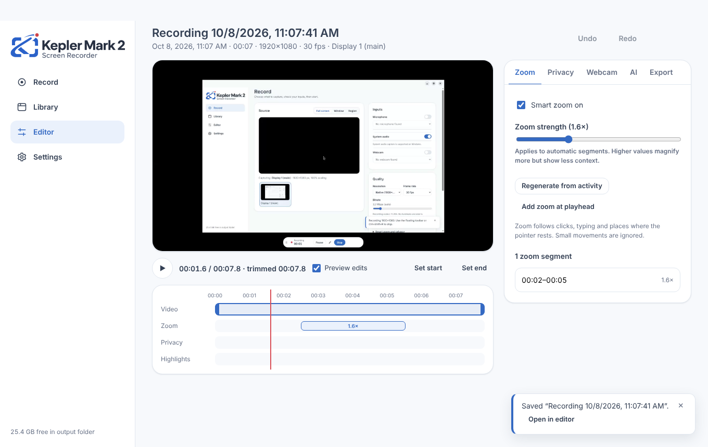

Record your screen, keep microphone and system audio on separate tracks, and turn recordings into clear tutorials.

## Download

**[Download Kepler Mark 2 for Windows (x64)](https://github.com/Shehanofficial/kepler-mark-2.-Screen-Recorder/releases/latest/download/Kepler-Mark-2-Screen-Recorder-1.0.0-x64-setup.exe)** · 182 MB · Windows 10 version 2004 or later

The installer is not code-signed yet. When Windows SmartScreen appears, choose **More info › Run anyway**.

## What it does

- **Record** full screen, a window or a region, with microphone, system audio and webcam recorded as separate tracks.
- **Smart zoom** follows clicks and typing with gentle, editable zoom. You can adjust or turn it off.
- **Edit without losing the original.** Trim, set audio levels, place the webcam and blur private areas. Changes apply only when you export.
- **Annotate live** with a pen, arrows, highlights and text from the floating toolbar.
- **Instant replay** saves the last 15 seconds to 2 minutes.
- **Search** recordings by on-screen text and, optionally, by speech. Both are indexed on your PC.
- **Draft tutorials and highlights** from your clicks. They are suggestions to review before sharing.

## Status

Version 1.0.0 was built and tested on Linux. It has not yet been tested on Windows hardware. Known gaps: multi-monitor capture, audio sync on long recordings, 4K/60 fps and hardware encoders are unverified.

## Licences

The installer includes FFmpeg, licensed under GPL-3.0. The full source code for this build is attached to each release as `kepler-mark-2-source-1.0.0.zip`, and third-party notices are in `LICENSES/THIRD_PARTY_NOTICES.md` inside it.

© 2026 Spark Digital Hub
